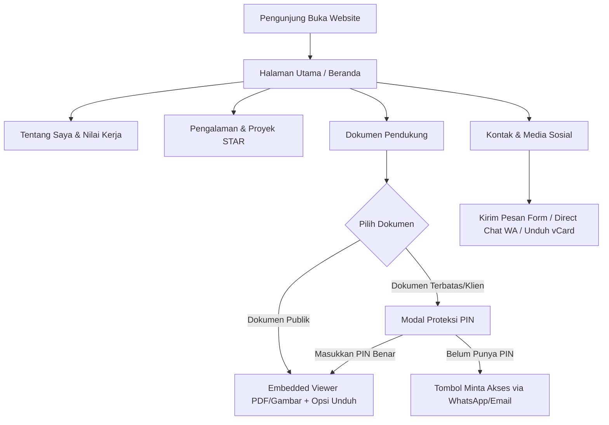

# PRD (Product Requirement Document): Website Portofolio Profesional & Document Showcase
Dokumen ini disusun oleh **ZettBOT by Zettbos** sebagai cetak biru resmi rekayasa sistem sebelum implementasi kode.

================================================================================
ZONA ATAS: SPESIFIKASI KEBUTUHAN PRODUK (BLUEPRINT AWAL)
================================================================================

## 1. Nama Projek & Problem Statement
- **Nama Projek:** Portfolio Web Profesional & Document Showcase (Dapat disesuaikan oleh pengguna).
- **Problem Statement:** 
  Profesional membutuhkan platform portofolio digital mandiri yang tidak hanya menampilkan profil dan riwayat kerja, namun juga mampu menyajikan bukti dokumen autentik (sertifikat, ijazah, lisensi) secara elegan melalui *embedded viewer*, menyediakan opsi unduh berkas resmi dengan penamaan rapi, melindungi privasi dengan penyensoran data sensitif (redaction), serta memproteksi portofolio klien terbatas dengan sistem proteksi kata sandi / PIN yang praktis.

## 2. Peran Pengguna (User Roles)
1. **Pengunjung Umum & Recruiter (HRD / Klien):**
   - Menjelajahi profil singkat (elevator pitch) dan bidang keahlian di Beranda.
   - Membaca latar belakang profesional, ringkasan pengalaman, dan filosofi kerja.
   - Meninjau riwayat kerja dan proyek unggulan dengan metode STAR (Situation, Task, Action, Result).
   - Membuka dan membaca dokumen sertifikat/ijazah langsung di browser tanpa harus mengunduh file terlebih dahulu.
   - Memfilter dokumen berdasarkan kategori (Sertifikasi, Lisensi, Ijazah, Penghargaan).
   - Membuka dokumen terbatas/rahasia dengan memasukkan PIN akses atau mengajukan permintaan akses (Request Access).
   - Mengunduh CV resmi dan salinan dokumen resmi yang terkurasi.
   - Menghubungi pemilik melalui formulir pesan instan, tautan media sosial profesional, atau direct WhatsApp chat.
2. **Pemilik Portofolio (Pengguna / Administrator):**
   - Memiliki kendali penuh atas konten profil, riwayat kerja, dan dokumen melalui berkas konfigurasi data terpusat (`data.js`) tanpa perlu mengutak-atik struktur HTML.
   - Menentukan dokumen mana yang bersifat publik dan mana yang dilindungi PIN/Kata Sandi.

## 3. Arsitektur & Lingkungan Kerja
- **Arsitektur:** Web Statis Modern Mandiri (Single Page Application dengan Navigasi Halus & Modular Data).
  - *Frontend:* HTML5 Semantik, Vanilla CSS (Sistem Desain Anti-AI berkelas, responsive fluid, micro-interactions), Vanilla JavaScript ES6+.
  - *Data Layer:* In-memory structured dataset (`js/data.js`), mempermudah pengguna memperbarui isi portofolio tanpa instalasi database rumit.
  - *Asset Storage:* Folder terstruktur `docs/` dan `images/` untuk CV resmi, sertifikat PDF, dan aset visual.
- **Hosting & Kompatibilitas:** 
  - Siap di-deploy instan dan 100% gratis ke GitHub Pages, Vercel, Netlify, atau Cloudflare Pages.
  - Mendukung pembukaan offline langsung dari file lokal (`index.html`).

## 4. Alur Kerja Aplikasi (User Flow)

## 5. Struktur Data Konfigurasi (`data.js`)
Struktur data dirancang terpusat, bersih, dan mudah diedit:
1. **Profil Pengguna:** Nama lengkap, gelar/headline, bio elevator pitch, avatar, link CV, kontak (email, WhatsApp, LinkedIn, GitHub).
2. **Keahlian (Skills):** Kategori keahlian (Teknis, Manajemen, Alat/Tools), level penguasaan.
3. **Pengalaman Kerja:** Posisi, perusahaan, periode kerja, ringkasan tanggung jawab.
4. **Proyek Unggulan:** Judul proyek, peran, durasi, tag teknologi, deskripsi metode STAR (Tantangan, Solusi/Aksi, Hasil terukur), tautan demo/repo, status kerahasiaan.
5. **Dokumen Pendukung:**
   - `id`: Kode dokumen unik (misal: `DOC-2026-001`).
   - `title`: Judul sertifikat/ijazah/dokumen.
   - `category`: Kategori (Sertifikasi, Lisensi, Ijazah, Penghargaan, Portofolio Klien).
   - `issuer`: Lembaga penerbit & tahun terbit.
   - `fileUrl`: Path file PDF/gambar di folder `docs/`.
   - `downloadName`: Nama file unduh resmi yang rapi (contoh: `Sertifikat_Google_Cloud_2026.pdf`).
   - `isProtected`: Boolean (`true` jika butuh PIN, `false` jika publik).
   - `accessPin`: Hash / kode PIN pembuka (default konfigurasi dapat diubah).
   - `redactionNotes`: Keterangan data yang disensor demi keamanan privasi (contoh: "NIK & Alamat telah disensor").

## 6. Aturan Validasi & Logika Khusus
1. **Embedded Document Viewer:**
   - Mendukung format PDF dan Gambar (PNG/JPG/WebP).
   - Dilengkapi toolbar: Zoom in/out, Fit to screen, Tombol Unduh Resmi, Tombol Tutup modal.
   - Tampilan watermark halus: *"Salinan Resmi Portofolio - Data Pribadi Terproteksi"* untuk mencegah penyalahgunaan dokumen.
2. **Proteksi Kata Sandi / PIN:**
   - Jika dokumen bertanda `isProtected: true`, dokumen tidak langsung dirender.
   - Sistem menampilkan dialog kunci PIN interaktif.
   - Jika PIN cocok, dokumen terbuka di viewer.
   - Jika salah, ada feedback visual getar (*shake animation*) dan tombol cepat *"Minta Akses ke Pemilik"*.
3. **Penyensoran & Keamanan Data (Privacy by Design):**
   - Tidak ada NIK, alamat rumah lengkap, tanggal lahir lengkap, atau nomor rekening yang ditampilkan di antarmuka maupun dokumen publik.
   - Dilengkapi badge tanda *"Verified & Redacted for Privacy"*.
4. **Instant Search & Kategori Filter:**
   - Filter tab kategori dokumen: *Semua, Sertifikasi, Lisensi, Ijazah, Portofolio Klien*.
   - Filter real-time kotak pencarian instan (mencari berdasarkan judul, penerbit, atau tag keahlian).
5. **In-Memory Caching & Smooth Routing:**
   - Perpindahan antar tab dan filter berlangsung instan (0 detik) tanpa reload halaman.

## 7. Rencana Antarmuka Pengguna (UI/UX)
1. **Bilah Navigasi (Navbar):**
   - Logo / Nama Pemilik dengan status aktif (*Available for Work / Open for Collaboration*).
   - Menu Cepat: Beranda, Tentang, Pengalaman, Proyek, Dokumen, Kontak.
   - Sakelar Tema (Dark Mode / Light Mode toggle yang halus).
   - Mobile Hamburger Menu dengan drawer ramah jempol.
2. **Hero Section (Beranda):**
   - Tipografi berbobot profesional (Anti-AI Aesthetic, palet Slate/Navy & Soft Shadows).
   - Headline tajam, elevator pitch singkat, dan badge keahlian utama.
   - Tombol CTA Utama: `[Unduh CV Resmi]` & `[Hubungi Saya]`.
3. **Tentang Saya & Nilai Kerja:**
   - Kisah perjalanan karier ringkas, prinsip/nilai kerja profesional.
   - Kartu metrik ringkasan (Grid 3 kolom: Jam Terbang / Tahun Pengalaman, Proyek Selesai, Sertifikasi Resmi).
4. **Pengalaman & Proyek Unggulan (Metode STAR):**
   - Timeline riwayat karier yang rapi.
   - Kartu proyek interaktif dengan rincian peran, tantangan, dan hasil nyata.
5. **Etalase Dokumen Pendukung:**
   - Baris filter kategori + kolom pencarian instan.
   - Kartu dokumen dengan preview thumbnail, badge kategori, dan indikator status akses (Publik / Dilindungi PIN).
   - Tombol `[Lihat Dokumen]` (Membuka Embedded Viewer) dan `[Unduh PDF Resmi]`.
6. **Bagian Kontak & Kartu Digital:**
   - Formulir pesan langsung (Nama, Email, Pesan).
   - Tombol Cepat: Direct WhatsApp Chat, LinkedIn, GitHub, Email resmi.
   - Tombol tambahan: `[Unduh Kontak Digital (vCard)]` untuk menyimpan kontak ke smartphone.

## 8. Kriteria Pengujian (Quality Checklist)
- [ ] Tampilan responsif sempurna di perangkat Mobile (HP) dan Desktop (PC/Laptop).
- [ ] Tombol CTA "Unduh CV" dan "Hubungi Saya" berfungsi presisi.
- [ ] Embedded viewer mampu membuka file PDF dan gambar tanpa error.
- [ ] Dokumen ber-PIN menampilkan modal kunci dan hanya terbuka dengan PIN yang benar.
- [ ] Tombol unduh menghasilkan nama berkas yang rapi dan profesional.
- [ ] Filter kategori dan pencarian instan bekerja secara real-time tanpa delay.
- [ ] Bebas dari informasi sensitif (NIK, rekening, tanggal lahir lengkap disensor).
- [ ] Sakelar mode gelap/terang (Dark/Light mode) bekerja mulus dan menyimpan preferensi pengguna di LocalStorage.

================================================================================
ZONA BAWAH: MASTER CONTEXT & LOGIKA SISTEM TERKINI (LIVING CONTEXT)
================================================================================
- **Status Arsitektur Aktif:** Standalone Modern Web Stack (HTML5 Semantik, Modern Vanilla CSS, Modular ES6 JS).
- **Format Data Aktif:** In-Memory Dataset di `js/data.js` (Profil, Skills, Timeline, Projects, Documents).
- **Logika Keamanan Aktif:** Client-side Redaction Simulation, Watermarked Document Viewer, Modal PIN Access Protection.
- **Log Pembaruan Resmi:**
  - `v1.0.0` (Inisialisasi): Penyusunan spesifikasi menyeluruh website portofolio profesional sesuai standar ZettBOT.
  - `v1.1.0` (Implementasi Lengkap): Pembuatan seluruh berkas inti (`index.html`, `css/style.css`, `js/data.js`, `js/app.js`, dan `docs/README.md`) dengan dukungan Embedded Document Viewer, Proteksi PIN, Sensor Privasi, Mode Dark/Light, dan Filter Instan.
