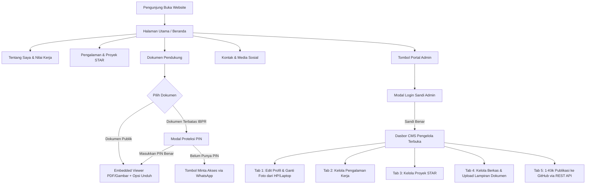

# PRD (Product Requirement Document): Website Portofolio Profesional & Document Showcase
Dokumen ini disusun oleh **ZettBOT by Zettbos** sebagai cetak biru resmi rekayasa sistem sebelum implementasi kode.

================================================================================
ZONA ATAS: SPESIFIKASI KEBUTUHAN PRODUK (BLUEPRINT AWAL)
================================================================================

## 1. Nama Projek & Problem Statement
- **Nama Projek:** Portofolio Profesional & Document Showcase - Erwin Ardi Nurcahyo.
- **Problem Statement:** 
  Profesional di bidang Safety & Operations (K3 Pertambangan & ERP SAP) membutuhkan platform portofolio digital mandiri yang menyajikan riwayat karier, inisiatif lapangan (metode STAR), serta bukti dokumen autentik (sertifikat BNSP, K3 Pertambangan, pelatihan operasional, dan ijazah S1 Sistem Informasi) secara elegan melalui *embedded viewer*, opsi unduh berkas resmi, sensor data pribadi (redaction), proteksi PIN pada dokumen sensitif (IBPR), serta sistem Dasbor Pengelola (CMS) terpadu di mana pemilik dapat mengedit seluruh konten profil, foto dari HP/laptop, pengalaman kerja, proyek, dan mengunggah berkas baru serta mempublikasikannya langsung ke GitHub Pages via API tanpa perlu menyentuh kodingan lagi.

## 2. Peran Pengguna (User Roles)
1. **Pengunjung Umum & Recruiter (HRD Tambang / Manajemen / Klien):**
   - Menjelajahi profil singkat (elevator pitch) dan bidang keahlian di Beranda.
   - Membaca latar belakang profesional, ringkasan pengalaman, dan nilai kerja (Zero Incident & Data Integrity).
   - Meninjau riwayat kerja (PT Borneo Indobara, PT Aviko Sepinggan SSB, BPS Banjarmasin) dan proyek unggulan dengan metode STAR.
   - Membuka dan membaca dokumen sertifikat/ijazah langsung di browser tanpa harus mengunduh file terlebih dahulu.
   - Memfilter dokumen berdasarkan kategori (Sertifikasi K3, BNSP, Operasional, Manajemen Risiko, Lisensi Kerja, Ijazah).
   - Membuka dokumen terbatas/rahasia dengan memasukkan PIN akses atau mengajukan permintaan akses via WhatsApp.
   - Mengunduh CV resmi dan salinan dokumen resmi yang terkurasi.
   - Menghubungi pemilik melalui pesan email, WhatsApp direct chat, atau menyimpan kontak vCard digital.
2. **Pemilik Portofolio (Erwin Ardi Nurcahyo / Administrator):**
   - Masuk melalui Portal Admin menggunakan kata sandi akses khusus.
   - Mengakses Dasbor CMS Terpadu (Tab Profil & Foto, Pengalaman Kerja, Proyek STAR, Berkas & Dokumen, dan Publikasi GitHub).
   - Mengganti foto profil dengan memilih foto langsung dari galeri HP atau laptop.
   - Menambah, mengedit, dan menghapus riwayat pengalaman kerja serta inisiatif proyek STAR.
   - Menambah berkas baru dengan melampirkan file dokumen/foto sertifikat asli dari perangkat.
   - Mempublikasikan seluruh perubahan langsung ke repositori GitHub via 1-Klik GitHub REST API tanpa menyentuh kode.
   - Mengunduh cadangan konfigurasi `data.js` atau mereset data ke versi default CV kapan saja.

## 3. Arsitektur & Lingkungan Kerja
- **Arsitektur:** Web Statis Modern Mandiri (Single Page Application dengan All-in-One Engine & In-Browser CMS).
  - *Frontend:* HTML5 Semantik, Vanilla CSS (Sistem Desain Anti-AI berkelas, responsive fluid, micro-interactions, dark/light theme), Vanilla JavaScript ES6+.
  - *Data Layer:* Dual-Layer Storage (Master dataset `js/data.js`, Persistent Browser `localStorage` untuk CMS State, & GitHub REST API commit).
  - *Asset Storage:* Folder terstruktur `docs/` untuk CV resmi dan sertifikat PDF, serta Base64 / Cloud Storage sync untuk foto & lampiran kustom.
- **Hosting & Kompatibilitas:** 
  - Siap di-deploy instan dan 100% gratis ke GitHub Pages, Vercel, Netlify, atau Cloudflare Pages tanpa membutuhkan backend berbayar.
  - Mendukung pembukaan offline langsung dari file lokal (`index.html`).

## 4. Alur Kerja Aplikasi (User Flow)

## 5. Kriteria Pengujian (Quality Checklist)
- [x] Profil resmi Erwin Ardi Nurcahyo (S1 Sistem Informasi & Safety Officer) tampil akurat di seluruh bagian.
- [x] Tampilan responsif sempurna di perangkat Mobile (HP) dan Desktop (PC/Laptop).
- [x] Portal Admin login berfungsi dengan kata sandi (default: `admin123`).
- [x] Dasbor CMS multi-tab terbuka dan dapat mengedit seluruh data secara visual.
- [x] Uploader foto profil mampu membaca dan mengompres foto dari galeri perangkat serta memperbarui avatar secara instan.
- [x] Pengalaman kerja dan proyek STAR dapat ditambah, diedit, dan dihapus langsung dari CMS.
- [x] Berkas dokumen dapat dilampirkan dengan file baru dari perangkat dan diubah/dihapus secara fleksibel.
- [x] Fitur "Publikasikan ke GitHub" terintegrasi dengan GitHub REST API untuk commit otomatis ke repositori.
- [x] Tombol "Unduh data.js" menghasilkan file konfigurasi utuh yang siap pakai.
- [x] Embedded viewer dan modal PIN bekerja mulus dengan proteksi sensor privasi.
- [x] Sakelar mode gelap/terang (Dark/Light mode) bekerja mulus.

================================================================================
ZONA BAWAH: MASTER CONTEXT & LOGIKA SISTEM TERKINI (LIVING CONTEXT)
================================================================================
- **Status Arsitektur Aktif:** Standalone All-in-One Web Application (HTML5 + Embedded Design System + Full In-Browser CMS Engine + GitHub REST API Sync Connector).
- **Pemilik Portofolio:** Erwin Ardi Nurcahyo (Safety Officer & Operations Specialist).
- **Format Data Aktif:** Structured Data di `js/data.js` & `localStorage['erwin_portfolio_master_v2']`.
- **Logika Keamanan Aktif:** Admin Authentication, PIN Document Locker (DOC-EAN-007 IBPR), Privacy Redaction Preview Watermarking, Safe Client-Side GitHub Token Storage.
- **Log Pembaruan Resmi:**
  - `v1.0.0` (Inisialisasi): Spesifikasi portofolio awal ZettBOT.
  - `v1.2.0` (Hotfix GitHub Pages): Penyatuan all-in-one CSS & JS ke dalam index.html untuk mengeliminasi 404.
  - `v2.0.0` (Rilis Portofolio Erwin Ardi Nurcahyo & Fitur Admin CRUD):
    * Revisi menyeluruh seluruh data, teks, riwayat kerja, dan dokumen sesuai referensi CV resmi Erwin Ardi Nurcahyo.
    * Penambahan sistem Portal Admin dengan modal login sandi.
  - `v2.1.0` (Full In-Browser CMS & GitHub Auto-Sync Engine):
    * Transformasi Portal Admin menjadi Dasbor CMS Multi-Tab lengkap (Profil & Foto, Pengalaman Kerja, Proyek STAR, Berkas & Dokumen, dan Publikasi GitHub).
    * Penambahan Uploader Foto Profil langsung dari galeri HP/laptop dengan kompresi visual otomatis.
    * Penambahan Lampiran Berkas Dokumen (PDF/Gambar) langsung dari perangkat.
    * Integrasi 1-Klik Simpan & Publikasikan ke GitHub via GitHub REST API sehingga pengguna tidak perlu membuka kodingan di GitHub lagi.
