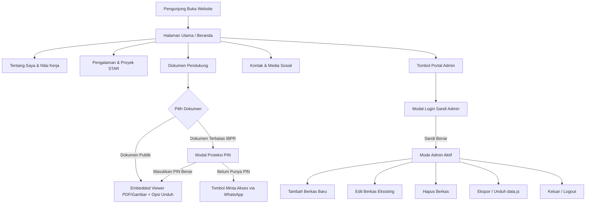

# PRD (Product Requirement Document): Website Portofolio Profesional & Document Showcase
Dokumen ini disusun oleh **ZettBOT by Zettbos** sebagai cetak biru resmi rekayasa sistem sebelum implementasi kode.

================================================================================
ZONA ATAS: SPESIFIKASI KEBUTUHAN PRODUK (BLUEPRINT AWAL)
================================================================================

## 1. Nama Projek & Problem Statement
- **Nama Projek:** Portofolio Profesional & Document Showcase - Erwin Ardi Nurcahyo.
- **Problem Statement:** 
  Profesional di bidang Safety & Operations (K3 Pertambangan & ERP SAP) membutuhkan platform portofolio digital mandiri yang menyajikan riwayat karier, inisiatif lapangan (metode STAR), serta bukti dokumen autentik (sertifikat BNSP, K3 Pertambangan, pelatihan operasional, dan ijazah S1 Sistem Informasi) secara elegan melalui *embedded viewer*, opsi unduh berkas resmi, sensor data pribadi (redaction), proteksi PIN pada dokumen sensitif (IBPR), serta kemudahan bagi pemilik untuk mengelola (tambah, edit, dan hapus) berkas portofolio secara mandiri kapan saja.

## 2. Peran Pengguna (User Roles)
1. **Pengunjung Umum & Recruiter (HRD Tambang / Manajemen / Klien):**
   - Menjelajahi profil singkat (elevator pitch) dan bidang keahlian di Beranda.
   - Membaca latar belakang profesional, ringkasan pengalaman, dan nilai kerja (Zero Incident & Data Integrity).
   - Meninjau riwayat kerja (PT Borneo Indobara, PT Aviko Sepinggan SSB, BPS Banjarmasin) dan proyek unggulan dengan metode STAR.
   - Membuka dan membaca dokumen sertifikat/ijazah langsung di browser tanpa harus mengunduh file terlebih dahulu.
   - Memfilter dokumen berdasarkan kategori (Sertifikasi K3, BNSP, Operasional, Manajemen Risiko, Lisensi Kerja, Ijazah).
   - Membuka dokumen terbatas/rahasia dengan memasukkan PIN akses atau mengajukan permintaan akses via WhatsApp.
   - Mengunduh CV resmi dan salinan dokumen resmi yang terkurasi.
   - Menghubungi pemilik melalui pesan email, WhatsApp direct chat, atau menyimpan kontak vCard digital.
2. **Pemilik Portofolio (Erwin Ardi Nurcahyo / Administrator):**
   - Masuk melalui Portal Admin menggunakan kata sandi akses khusus.
   - Menambahkan sertifikat atau berkas baru lengkap dengan judul, kategori, penerbit, nomor kredensial, dan status proteksi PIN.
   - Mengedit rincian dokumen yang telah ada langsung dari kartu dokumen.
   - Menghapus dokumen yang tidak lagi diperlukan dari etalase.
   - Mengekspor/mengunduh data terbaru (`data.js`) untuk diperbarui ke hosting/GitHub Pages secara permanen.
   - Mereset data kembali ke versi default CV kapan saja.

## 3. Arsitektur & Lingkungan Kerja
- **Arsitektur:** Web Statis Modern Mandiri (Single Page Application dengan All-in-One Engine & Modular Sync).
  - *Frontend:* HTML5 Semantik, Vanilla CSS (Sistem Desain Anti-AI berkelas, responsive fluid, micro-interactions, dark/light theme), Vanilla JavaScript ES6+.
  - *Data Layer:* Dual-Layer Storage (Master dataset `js/data.js` & Persistent Browser `localStorage` untuk Admin CRUD).
  - *Asset Storage:* Folder terstruktur `docs/` untuk CV resmi dan sertifikat PDF.
- **Hosting & Kompatibilitas:** 
  - Siap di-deploy instan dan 100% gratis ke GitHub Pages, Vercel, Netlify, atau Cloudflare Pages tanpa membutuhkan backend berbayar.
  - Mendukung pembukaan offline langsung dari file lokal (`index.html`).

## 4. Alur Kerja Aplikasi (User Flow)

## 5. Struktur Data Konfigurasi (`data.js`)
Struktur data dirancang terpusat, bersih, dan mudah diedit:
1. **Profil Pengguna:** Nama lengkap, gelar/headline, bio, filosofi kerja, avatar, kontak (WhatsApp, email, domisili).
2. **Keahlian (Skills):** K3 Pertambangan, ERP SAP & Analisis Data, IT Web & Digitalisasi, Desain Visual & Soft Skills.
3. **Pengalaman Kerja:** PT ERM Site Borneo Indobara (BIB), PT Aviko Sepinggan Site PT SSB, BPS Banjarmasin.
4. **Proyek Unggulan (STAR):** Dashboard Pelaporan K3 Real-Time, Integrasi Rantai Pasok SAP, Aplikasi Pengarsipan Web BPS.
5. **Dokumen Pendukung:**
   - 7 Sertifikat Resmi CV (BNSP, POC Fleet Management, PWP Analisis Kerja Aman, PKK Izin Kerja Khusus, PKK K3 Pertambangan, PWP Safety Meeting, PWP IBPR).
   - Ijazah S1 Sistem Informasi (STMIK Indonesia Banjarmasin - IPK 3,44) & SMKN 1 Sungai Loban (Multimedia).

## 6. Kriteria Pengujian (Quality Checklist)
- [x] Profil resmi Erwin Ardi Nurcahyo (S1 Sistem Informasi & Safety Officer) tampil akurat di seluruh bagian.
- [x] Tampilan responsif sempurna di perangkat Mobile (HP) dan Desktop (PC/Laptop).
- [x] Portal Admin login berfungsi dengan kata sandi (default: `admin123`).
- [x] Form Tambah Dokumen Baru berfungsi dan langsung tampil di etalase.
- [x] Tombol Edit Dokumen mampu mengubah rincian berkas secara real-time.
- [x] Tombol Hapus Dokumen bekerja dengan konfirmasi aman.
- [x] Perubahan dokumen tersimpan secara persisten di LocalStorage (tidak hilang saat reload).
- [x] Tombol "Unduh data.js" menghasilkan file konfigurasi utuh yang siap pakai.
- [x] Embedded viewer dan modal PIN bekerja mulus dengan proteksi sensor privasi.
- [x] Sakelar mode gelap/terang (Dark/Light mode) bekerja mulus.

================================================================================
ZONA BAWAH: MASTER CONTEXT & LOGIKA SISTEM TERKINI (LIVING CONTEXT)
================================================================================
- **Status Arsitektur Aktif:** Standalone All-in-One Web Application (HTML5 + Embedded Design System + In-Memory & LocalStorage CRUD Engine) dengan sinkronisasi modular ke `js/data.js`.
- **Pemilik Portofolio:** Erwin Ardi Nurcahyo (Safety Officer & Operations Specialist).
- **Format Data Aktif:** Structured Data di `js/data.js` & `localStorage['erwin_portfolio_docs_v1']`.
- **Logika Keamanan Aktif:** Admin Authentication, PIN Document Locker (DOC-EAN-007 IBPR), Privacy Redaction Preview Watermarking.
- **Log Pembaruan Resmi:**
  - `v1.0.0` (Inisialisasi): Spesifikasi portofolio awal ZettBOT.
  - `v1.2.0` (Hotfix GitHub Pages): Penyatuan all-in-one CSS & JS ke dalam index.html untuk mengeliminasi 404.
  - `v2.0.0` (Rilis Portofolio Erwin Ardi Nurcahyo & Fitur Admin CRUD):
    * Revisi menyeluruh seluruh data, teks, riwayat kerja, dan dokumen sesuai referensi CV resmi Erwin Ardi Nurcahyo.
    * Penambahan sistem Portal Admin dengan modal login sandi.
    * Penambahan toolbar admin dan fitur CRUD (Tambah, Edit, Hapus Berkas) dengan penyimpanan persisten di LocalStorage.
    * Penambahan fitur Ekspor Data (`data.js`) dan Reset Data ke versi asli CV.
